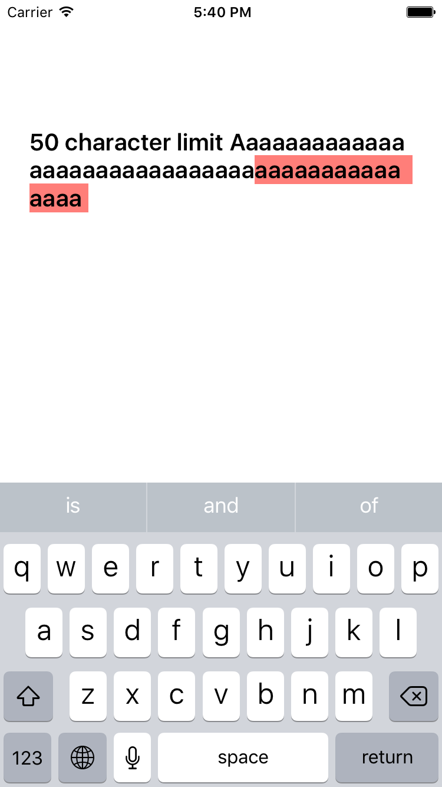

# HighlightTextView

<p align="center">
  
</p>

## Requirements

Swift **3.0**

## Usage
```swift
let textView = HighlightTextView()

// set character limit
textView.characterLimit = 200

// set background color
textView.overLimitBackgroundColor = UIColor.red
```
