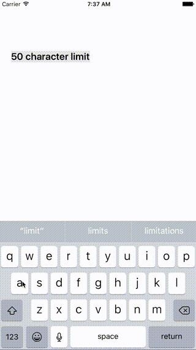

# HighlightTextView

[](https://github.com/Carthage/Carthage)

<p align="center">
  
  
</p>

## Requirements

Swift **3.0**
iOS **8.0+**

## Installation

### Carthage

HighlightTextView is available through Carthage. To install it, simply add the following line to your Cartfile:
```
github "yusayusa/HighlightTextView"
```

### CocoaPods

```
pod "HighlightTextView"
```

## Usage
```swift
let textView: UITextView

// set maximum character limit and background color, minimum character limit and background color

textView.setHighlight(
  range: Range(uncheckedBounds: (lower: 20, upper: 50)),
  minHighlightColor: UIColor.gray,
  maxHighlightColor: UIColor.red
)
```

## License
HighlightTextView is released under the MIT license. Go read the LICENSE file for more information.
